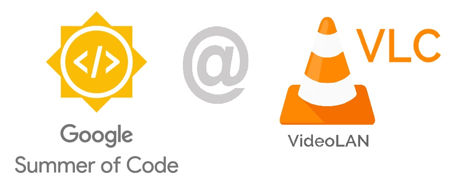

# GSoC '24 Report - VLC : The Ultimate Media Player

**Student:** Darshan Jain ([@Thrillseekr](https://code.videolan.org/Thrillseekr))

**Organization:** [VideoLAN](https://www.videolan.org/)

**Project:** [VLC Qt Interface Redesign](https://summerofcode.withgoogle.com/programs/2024/projects/qOI0v3an)

**Time zone:** Indian Standard Time (UTC + 5:30)

**Mentor:** Pierre Lamot
 

---

## VLC 4.0 Project
VLC 4.0 introduces a modern Qt interface that enhances usability while maintaining the familiar experience users love. This update brings a fresh look, making interaction smoother for billions of users worldwide. VLC remains a versatile, open-source multimedia engine, offering broad compatibility across platforms and devices, making it a top choice for media playback.

### VLC Qt Interface 
The VLC 4.0 Qt interface brings a sleek, modern design that enhances usability and visual appeal. Prioritizing clarity and ease of use, this interface offers an intuitive experience. Its versatility shines across both Windows and GNU/Linux, providing consistent multimedia performance and accessibility for users on various platforms.
 
The video section is a modern design with quick access to recently watched content, making navigation easy. The music section is organized into Artists, Albums, Tracks, and Genres for effortless browsing. Tracks are neatly listed with sorting options by title, artist, and more. Playlists are customizable and seamless, offering easy control for creating the perfect media mix.

---

## Milestones

### 📌 Jan - May : Contributions before Official Coding Period

⇒ MR: [!4841](https://code.videolan.org/videolan/vlc/-/merge_requests/4841) (Merged)\
Commit: [32896e88](https://code.videolan.org/videolan/vlc/-/commit/32896e8848c7421f00d962e381eb457486462f37?merge_request_iid=4841) qml: fix Mismatching string in MusicArtist.qml

⇒ MR: [!5047](https://code.videolan.org/videolan/vlc/-/merge_requests/5047) (Merged)\
Commit: [50960ca5](https://code.videolan.org/videolan/vlc/-/commit/50960ca5531e9e8b43e3a41a28cd928b6d2d4da2?merge_request_iid=5047) qt: mlplaylist: Display duration from MediaLibrary

⇒ Issue: [#28341](https://code.videolan.org/videolan/vlc/-/issues/28341)\
MR: [!4984](https://code.videolan.org/videolan/vlc/-/merge_requests/4984) (Merged)\
Commit: [4aecd897](https://code.videolan.org/videolan/vlc/-/commit/4aecd897f708d8f41e35b9d50081d82dd70c63f6?merge_request_iid=4984) qt: Update CSD Icons to Segoe Fonts available in different Windows Version

⇒ Issue: [#28505](https://code.videolan.org/videolan/vlc/-/issues/28505)\
MR: [!5045](https://code.videolan.org/videolan/vlc/-/merge_requests/5045) (Merged)
Commits:\
• [f4a2f119](https://code.videolan.org/videolan/vlc/-/commit/f4a2f119199788316da7a11fbd06fd7b263984ba?merge_request_iid=5045) qt: mlalbummodel: Sort Title by Alphabetical Order\
• [5cd2d7ae](https://code.videolan.org/videolan/vlc/-/commit/5cd2d7aec11914d0e6c6ef0b5e7c02aeb1bc3e3b?merge_request_iid=5045) qt: MusicArtistsAlbums: add Release Year Sorting Criteria for Albums

⇒ MR: [!5081](https://code.videolan.org/videolan/vlc/-/merge_requests/5081) (Merged)\
Commit: [32896e88](https://code.videolan.org/videolan/vlc/-/commit/32896e8848c7421f00d962e381eb457486462f37?merge_request_iid=4841) qt: CSDWindowButton: import org.videolan.vlc 0.1 library for rendering MainCtx\

⇒ Issue: [#28422](https://code.videolan.org/videolan/vlc/-/issues/28422)\
MR: [!4892](https://code.videolan.org/videolan/vlc/-/merge_requests/4892) (Merged)\
Commits: [c55688b7](https://code.videolan.org/videolan/vlc/-/commit/c55688b7fcd3b231c45bc84a4e2860a37c475fa8?merge_request_iid=4892) qml: Renamed File ScrollingText.qml

 

### 📌 May 1 - May 26 : Community Bonding Period
During the community bonding period, I actively engaged with mentors, senior members, and fellow contributors to learn more about their projects and working domains within VLC. I also resumed contributions to the VLC Qt Interface and dedicated time to exploring and learning [GammaRay](https://github.com/KDAB/GammaRay) (a powerful tool developed by KDAB for inspecting and debugging Qt applications) and its features. This interaction and learning laid a strong foundation for my GSoC journey.

 

### 📌 May 27 - Aug 19 : Coding Period

#### ✔ Task 1 : Introducing Minimal View for Player
The Minimal View in VLC is a simplified interface mode designed to focus on core media playback functions while minimizing distractions when in Player View. Key features include:

- **Compact User Interface:** The interface is streamlined, showing only essential playback controls like play, pause, and volume.
- **Reduced Controls:** Advanced settings and non-critical features like playlists are hidden, ensuring a clutter-free experience.
- **Focus on Content:** The emphasis is on media playback by maximizing screen space and minimizing distractions.
- **Customizable Appearance:** Users can customize which controls remain visible and switch between Minimal View and detailed views.

**Implementation in VLC:**
- **Qt Interface:** Access Minimal View options in VLC Preferences.
- **Keyboard Shortcut:** Activate Minimal View using `Ctrl+H`.
- **View Menu:** Enable Minimal View from the top-right View menu.
- **CLI:** from the Command Line Options using `--qt-minimal-view`

#### [MR!13: [GSoC'24] Introducing Minimal View for Player](https://code.videolan.org/Thrillseekr/vlc/-/merge_requests/13)

**Commits:**
- [qt: MainCtx: Expose Minimal View Property](https://code.videolan.org/Thrillseekr/vlc/-/merge_requests/13/diffs?commit_id=af01e00eaff39a1cfc73d2bc10640b7b002d7a86)
- [qt: Update Makefile & meson.build with PlayerToolbarVisibility & MinimalView class](https://code.videolan.org/Thrillseekr/vlc/-/merge_requests/13/diffs?commit_id=e2b0c35e699d4a40fa4e22c5794085edd039945a)
- [qt: Menus: Add QmlAudioContextMenu for Music Playback and Update Player Menus with close() function](https://code.videolan.org/Thrillseekr/vlc/-/merge_requests/13/diffs?commit_id=17577fc9fed6c60efa2db945116a4d85819f0f41)
- [qml: Player: Update PlayerPlaylistVisibility State Machine](https://code.videolan.org/Thrillseekr/vlc/-/merge_requests/13/diffs?commit_id=47dc9ebc0097d33d30bad2b87734f02db64661ef)
- [qml: Player: Update Player.qml Minimal View and other features](https://code.videolan.org/Thrillseekr/vlc/-/merge_requests/13/diffs?commit_id=e9422ce0e55617a987c80bac40e4b8f8284de2ba)
- [qml: Menus: Access Minimal View from View Menu and Shortcut "CTRL + H"](https://code.videolan.org/Thrillseekr/vlc/-/merge_requests/13/diffs?commit_id=3d0692170575d7c6bf3ad674da8e9704d5b29de8)
- [qml: Player: Implementing Force Unlock to Player components](https://code.videolan.org/Thrillseekr/vlc/-/merge_requests/13/diffs?commit_id=34ff48c4c800966be9f5bc1910f52598313bf2c6)
 

**Key Takeaways:**
- Gained understanding of **signals and slots, state machines**, and various components of the player view.
- Found the control bar complex but intriguing.
- Learned and applied **SOLID** principles to improve code quality.
  
 

#### 📌 July 12 : Mid - Term Evaluations
By the mid-term evaluations, I had completed a significant task and submitted it to my mentor. This task was extensive and provided valuable learning opportunities. I received constructive feedback from my mentor, which highlighted both strengths and areas for improvement. I took this feedback seriously and made a concerted effort to address the suggestions and integrate the improvements into my subsequent tasks. This approach significantly enhanced my performance and contributed to my overall growth during the project.

 

#### ✔ Task 2 : Add Support for `no-qt-bgcone`
The feature allows to hide the artwork and cone placeholder in the Player View. This can be activated from extended settings or from Command Line using `--no-qt-bgcone`

#### [MR!14: [GSoC'24] Add Support for `--no-qt-bgcone`](https://code.videolan.org/Thrillseekr/vlc/-/merge_requests/14)

**Commits:**
- [qt: Add Support for --no-qt-bgcone with CLI](https://code.videolan.org/Thrillseekr/vlc/-/merge_requests/14/diffs?commit_id=9db4d15089fcebd1b6921e96ca07fe8dba90dffb)
 

**Key Takeaways:**
- Learned the working of <b>Command line</b> options with the Qt Interface
  
 

#### ✔ Task 3 : [GSoC'24] Introducing Parental Mode for secure access of features and settings
Implemented a parental mode feature that requires users to enter a password to access the preferences settings, enhancing security and control over the application’s configuration.

#### [MR!15: Introducing Parental Mode for secure access of features and settings](https://code.videolan.org/Thrillseekr/vlc/-/merge_requests/15/commits)

**Commits:**
- [qt: dialogs: Add Parental Mode for secure access of different features](https://code.videolan.org/Thrillseekr/vlc/-/merge_requests/15/diffs?commit_id=5bfd7249150eb5cb469faccc1d2d3a54614e33fd)
- [qt: Dialogs_Provider: Implement the functionality for Parental Mode by](https://code.videolan.org/Thrillseekr/vlc/-/merge_requests/15/diffs?commit_id=4cbd873eda0d5e87b2ac669da2ee3e09aabec9db)
- [qt: Add Parental Mode "password" to configurations](https://code.videolan.org/Thrillseekr/vlc/-/merge_requests/15/diffs?commit_id=c37312fdb85c8b2200b01af758b355e324d2d2b5)
 

**Key Takeaways:**
- Gained experience in creating custom dialogs.
- Developed skills in integrating configurations, such as password protection.
- Enhanced understanding of callback mechanisms in C++.

---

## Post GSoC Period
As all assigned tasks are completed and nearly fully tested, the focus now shifts to rigorous testing across various scenarios and test cases to ensure the code's efficiency and readiness for merging.
Moving forward, I will collaborate with my mentor Pierre to thoroughly test the implementation.

**I will continue contributing to this great project as much as I can, under the guidance of the team. I aim to keep learning and upskilling myself throughout the process.**

---

## Gratitude and Acknowledgments 

I wanted to express my heartfelt thanks **Pierre** for your invaluable guidance throughout this project. My open-source journey with this great project has been a tremendous learning experience, and your feedback played a crucial role in that. I’ve gained a lot of knowledge and skills thanks to your support and mentorship.

I would also like to extend my gratitude to the entire **VideoLAN** team. Working with such a dedicated and talented group has been inspiring and has greatly contributed to my growth.

Thank you all for making this journey so enriching and impactful.

